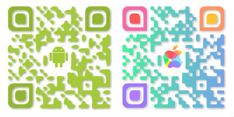

title: Share your WiFi Password with a QR Code - Part 1
date: 2016-10-20
date_long: 20 October 2016
author: Todd Johnson
banner: banner.png

So if you're smart about your home network security, chances are that you have either a long and/or complex password. When your family or friends come over it can be very annoying either trying to tell them the password and they type it wrong or to take their phone and type it in yourself. What's the solution? Share your network details with a QR Code!

## Create a QR Code

So this method really only works 100% with Android, with iOS, the user has the option to copy the SSID (Network Name) and password in *Settings* manually. (NOTE: iOS workaround coming soon in Part 2).

### Collect the required network details

* SSID (Network Name)
* Password
* Security Protocol (WEP, WPA/WPA2)

### Create the QR Code

There are hundreds of QR Generators on the internet, however, I chose [UniTag](https://www.unitag.io/qrcode). Why? Because with UniTag I can create QR Codes that look like these...

After creating an account at UniTag, you will be at your dashboard. Click on the **Start and create a QR Code** button.

Click on the **Static** checkbox and then click on the **Other Types** tab.

On the **Other Types** tab click on the **Wireless Network** option. Enter your network credentials that we collected earlier. Click on the **Confirm** button.

Technically we're done and you can now go ahead and click the **Save and close** button. Print the QR Code and stick to your router (or anywhere else you want to put it up. If you want to have a QR Code like the above examples have a play with the **Customisation** section or select from one of the templates.

Now when users scan your QR Code it will connect to your network automatically (Android), no more typing the password in!

![GIF Animation of Android phone scanning QR Code and connecting to network]

iOS users are left a bit in the lurch however and when scanning the QR code will only display the SSID and password and the user can copy and paste into **Settings**.
There is, however, a work-around for iOS which I will post in [Part 2](http://blog.toddjohnson.com.au/share-your-wifi-password-with-a-qr-code-part-2/) of this article.

So where is this QR Scanner app on my phone? UniTag has a nifty QR Scanner app on both Android and iPhone.

**NOTE:** It is recommended that you set up a guest network for family and friends to connect to. Most modern routers have this ability (even most ISP's modems/routers).
